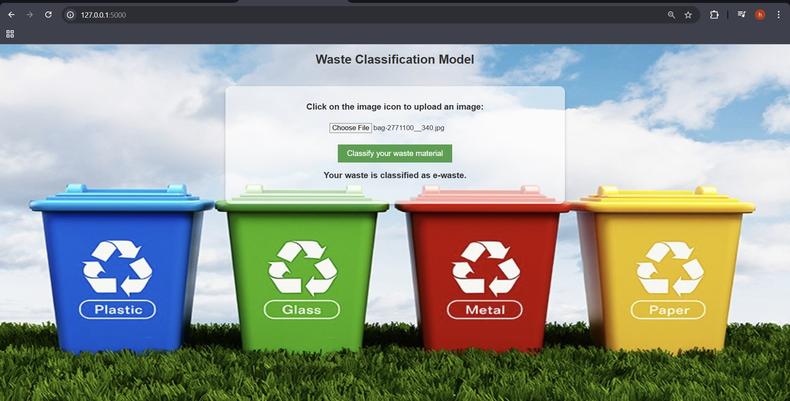

# Waste Classification Model

This project is a **Waste Classification System** that uses a deep learning model to classify waste into different categories such as paper, e-waste, organic, plastic, metal, and glass. The system is built using TensorFlow and Flask, providing a user-friendly web interface for waste classification.

---

## Example Output

Here is an example of the waste classification system in action:



## Project Overview

### Features:

- **Image Upload**: Users can upload an image of waste material through the web interface.
- **Waste Classification**: The system predicts the category of the waste using a trained deep learning model.
- **Responsive Web Interface**: A user-friendly interface built with HTML, CSS, and Flask.
- **Dynamic Background**: A visually appealing background image for the web application.
- **Data Augmentation**: The model uses data augmentation techniques to improve accuracy.

### Waste Categories:

1. Paper
2. E-Waste
3. Organic
4. Plastic
5. Metal
6. Glass

---

## Project Structure

```
   waste-classification-model/
   ├── app.py                  # Flask backend for the web application
   ├── model.py                # Script for training and saving the model
   ├── wastemodel.ipynb        # Jupyter Notebook for model experimentation
   ├── templates/
   │   └── index.html          # Frontend HTML file for the web interface
   ├── static/
   │   └── background.jpg      # Background image for the web application
   ├── README.md               # Project documentation
   └── requirements.txt        # List of required Python libraries
```

---

## How to Run the Project

### Prerequisites:

- Python 3.12 or higher
- Required Python libraries:
  - Flask
  - TensorFlow
  - NumPy

### Steps:

1. Clone the repository:

   ```bash
   git clone https://github.com/himeshnama007/WasteClassificationModel.git
   cd waste-classification-model
   ```
2. Install the required dependencies:

   ```bash
   pip install -r requirements.txt
   ```
3. Train the model (if needed):

   - Run model.py or wastemodel.ipynb to train the model and save it as `model.h5`.
4. Start the Flask application:

   ```bash
   python app.py
   ```
5. Open your browser and navigate to:

   ```
   http://127.0.0.1:5000/
   ```
6. Upload an image of waste and view the classification result.

---

## Key Files

1. **`app.py`**:

   - Backend logic for the Flask application.
   - Loads the trained model and handles image classification requests.
2. **`model.py`**:

   - Contains the code for training the waste classification model.
   - Uses TensorFlow and Keras for building and training the model.
3. **`model_train.ipynb`**:

   - Jupyter Notebook for experimenting with the model and data preprocessing.
4. **`index.html`**:

   - Frontend HTML file for the web interface.
   - Allows users to upload images and view classification results.
5. **`background.jpg`**:

   - Background image for the web application.
6. **`download.txt`**:

   - A list of all required Python libraries for the project.

---

## Future Enhancements

- Add more waste categories for classification.
- Improve the model's accuracy with additional training data.
- Deploy the application to a cloud platform like AWS, Azure, or Heroku.
- Add multilingual support for the web interface.
- Implement a database to store user-uploaded images and classification results.

---

## License

This project is licensed under the MIT License. Feel free to use and modify it for your own purposes.

---
